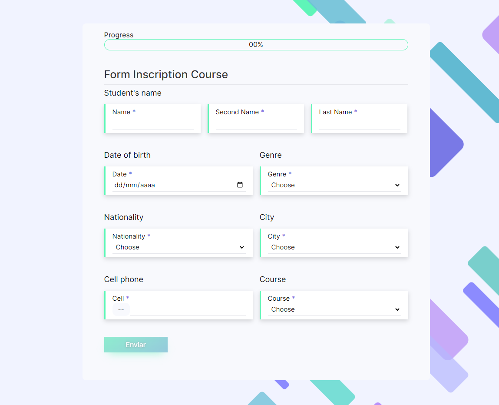

Web: [# Form-validation-hunigole](https://hunigolesan.github.io/form-validation-hunigole)
## Welcome! 👋

## Skills

Aquí se encuentran las tecnologías y herramientas utilizadas en este proyecto:

- **HTML5**: Lenguaje de marcado utilizado para la estructura de las páginas web.
- **CSS3**: Lenguaje de estilo utilizado para el diseño y la presentación.
- **JavaScript**: Lenguaje de programación utilizado para la funcionalidad interactiva del sitio.
- **Figma**: Herramienta utilizada para el diseño de la interfaz de usuario.

[Figma](https://www.figma.com/file/dRKQfEjm5VwVsXwuFA0wAT/form-inscription-Design?type=design&node-id=0%3A1&mode=design&t=GnVXws3AS85gRt5m-1)